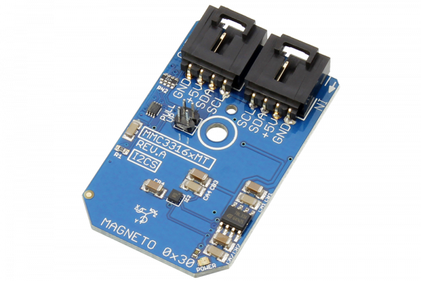

# MMC3316xMT

The MMC3316xMT is a 3-axis magnetic sensor with on-chip signal processing.

This device can measure magnetic fields within the full scale range of ±16 Gauss with heading accuracies of 1°.
This Device is available from www.ncd.io 

[SKU: MMC3316xMT_I2CS]

(https://store.ncd.io/product/mmc3316xmt-%C2%B116-gauss-3-axis-magnetic-sensor-i2c-mini-module/)
This Sample code can be used with Arduino.

Hardware needed to interface MMC3316xMT sensor with Arduino

1. <a href="https://store.ncd.io/product/i2c-shield-for-arduino-nano/">Arduino Nano</a>

2. <a href="https://store.ncd.io/product/i2c-shield-for-arduino-micro-with-i2c-expansion-port/">Arduino Micro</a>

3. <a href="https://store.ncd.io/product/i2c-shield-for-arduino-uno/">Arduino uno</a>

4. <a href="https://store.ncd.io/product/dual-i2c-shield-for-arduino-due-with-modular-communications-interface/">Arduino Due</a>

5. <a href="https://store.ncd.io/product/mmc3316xmt-%C2%B116-gauss-3-axis-magnetic-sensor-i2c-mini-module/">MMC3316xMT 3Axis Magnetic Sensor</a>

6. <a href="https://store.ncd.io/product/i%C2%B2c-cable/">I2C Cable</a>

MMC3316xMT:

The MMC3316xMT is a 3-axis magnetic sensor with on-chip signal processing.

This device can measure magnetic fields within the full scale range of ±16 Gauss with heading accuracies of 1°.

Applications:

• Electronic Compassing

• GPS Navigation Assist

• Magnetic Field Measurement

How to Use the MMC3316xMT Arduino Library

The MMC3316xMT has a number of settings, which can be configured based on user requirements.
          
1.Address calling:The following command is used to call the MMC3316xMT sensor to begin the transmission.

            mmc.getAddr_MMC3316xMT(MMC3316xMT_DEFAULT_ADDRESS_MAG);      // 0x30
            
2.Sensor setup:The following command is used to setup the sensor.

             mmc.setUpMagnetometer();
             
3.Output measurement:The following command is used to measure the output of MMC3316xMT sensor.             
             
              mmc.Measure_Magnetometer();

